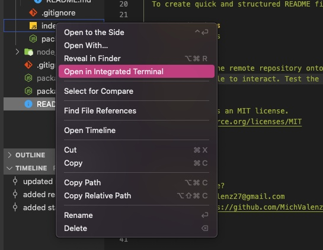
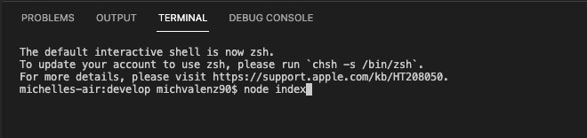
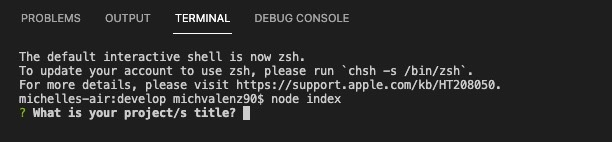

   

   # README-generator

  ## Description 
  The README-generator creates hassle-free README files for users. The user simply answers prompt questions and at the end will receive a README file for their project. 
  ## Table of Contents

  * [Installation](#Installation)
  * [Usage](#Usage)
  * [Contributions](#Contributions)
  * [Testing](#Testing)
  * [License](#License)
  * [Questions](#Questions)

  ## Installation
  The user must clone the remote repository onto their computer and use the terminal to run the generator.

  ## Usage
  To create quick and structured README files. 

  ## Contributions
  No contributions

  ## Testing 
  After cloning the remote repository onto your computer open in desired code editor and use the terminal on the index.js file to interact. Test the project by answering the prompt questions and creating a test README.

## Step 1. 
* Open index.js in Terminal

## Step 2. 
* Run node index to start the prompts

## Step 3. 
* Answer each prompt

  ## License 
  This project has an MIT license.
  https://opensource.org/licenses/MIT

 
  

  ## Questions
  Need to reach me?
  * Email: michvalenz27@gmail.com
  * [GitHub](https://github.com/MichValenz/README-generator)

  ## Walkthrough Video
  * https://watch.screencastify.com/v/9FXwkzin8csXxatpZjmS

       